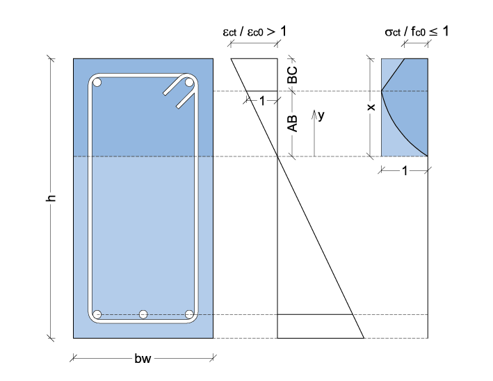

.. _Rettangolare:

********************
Sezione Rettangolare
********************

Il legame costitutivo per il calcestruzzo in compressione è generato mediante l'impiego di due curve distinte:

* una parabolica sino al raggiungimento del massimo valore di resistenza :math:`f_{c0}` e quindi di deformazione corrispondente :math:`\varepsilon_{c0}`;

* una lineare sino al raggiungimento del valore di tensione ultima del materiale :math:`f_{cu} \leq f_{c0}` e quindi di deformazione corrispondente :math:`\varepsilon_{cu}`.

Pertanto, nel seguito, si distingueranno i due casi a) e b).

a) :math:`\varepsilon_{ct} / \varepsilon_{c0} \leq 1`

.. image:: img/R1.png

Indicando con:
:math:`f_{c0}` la tensione massima nel calcestruzzo
:math:`\varepsilon_{c0}` la corrispondente deformazione
:math:`\sigma_c` e :math:`\varepsilon_c` la tensione e la deformazione in compressione del calcestruzzo

l'equazione della parabola di Hognestad si scrive:

.. math::
    :label: R1

    \frac{ \sigma_c (\varepsilon_c) }{ f_{c0} } =
    2 ~ \Bigl( \frac{\varepsilon_c }{ \varepsilon_{c0} } \Bigr) -
    \Bigl( \frac{\varepsilon_c }{ \varepsilon_{c0} } \Bigr)^2

Introducendo i seguenti termini adimensionali di tensione e deformazione:
:math:`s_c = \sigma_c / f_{c0}` e :math:`e_c = \varepsilon_c / \varepsilon_{c0}`,
l'equazione adimensionale del ramo di parabola diventa:

.. math::
    :label: R2

    s_c (e_c) = 2 ~ e_c - e_c^2

Al fine di esprimere la tensione in funzione della distanza dall'asse neutro :math:`(y)`, si opera una trasformazione di variabili. Indicando con :math:`e_{ct}` la deformazione di compressione adimensionalizzata della fibra di bordo, si pone: :math:`e_c (y) = e_{ct} ~ (y / x)`.

La :eq:`R2` diventa:

.. math::
    :label: R3

    s_c (y) = 2 ~ \Bigl( e_{ct} ~ \frac{y}{x} \Bigr) - \Bigl( e_{ct} ~ \frac{y}{x} \Bigr)^2
    
Il coefficiente di riempimento :math:`\beta_{1}` è quindi definito come il rapporto tra il diagramma effettivo delle tensioni e quello rettangolare. Per cui si ricava come segue:

.. math::
    :label: R4

    \beta_1 =
    \frac{1}{x} \int_0^x s_c(y) \,dy
    
Sostituendo la :eq:`R3` nella :eq:`R4` e risolvendo l'integrale definito, si ottiene il coefficiente di riempimento in funzione di :math:`e_{ct}`:

.. math::
    :label: R5

    \beta_1 =
    \frac{ e_{ct} ~ ( 3 - e_{ct} ) } { 3 }
    
Il coefficiente :math:`\beta_{2}` consente di valutare l'esatta posizione del baricentro del diagramma delle tensioni.
Si calcola come :math:`\beta_2 = 1 - y_G / x`
essendo :math:`y_G / x` l'ascissa del baricentro del diagramma delle tensioni, adimensionalizzata rispetto alla posizione dell'asse neutro. Quest'ultima si calcola come segue:

.. math::
    :label: R6

    \frac{y_G}{x} = 
    \frac{1}{x}
    \frac{ \int_0^x s_c(y) y \,dy }{ \int_0^x s_c(y) \,dy }
    
Sostituendo la :eq:`R3` nella :eq:`R6` e risolvendo gli integrali definiti, si ottiene l'espressione di :math:`y_G / x` la quale consente di calcolare il coefficiente :math:`\beta_{2}`:

.. math::
    :label: R7

    \beta_2 =
    1 - \frac{y_G} {x} =
    \frac{ e_{ct} - 4 } { 4 ~ ( e_{ct} - 3) }

b) :math:`\varepsilon_{ct} / \varepsilon_{c0} > 1`

Il ramo di curva post-picco è assunto lineare sino al raggiungimento della deformazione ultima del calcestruzzo :math:`\varepsilon_{cu}`.
Introducendo le variabili adimensionali relative alla deformazione ultima :math:`e_{cu} = \varepsilon_{cu} / \varepsilon_{c0}` ed alla relativa tensione :math:`s_{cu} = \sigma_{cu} / f_{c0}`, l'equazione del ramo lineare si scrive come segue:

.. math::
    :label: R8

    s_c( e_{c} ) =
    1 - \Bigl( \frac{ s_{cu} - 1 } { e_{cu} - 1 } \Bigr) ~ ( 1 - e_{c} )

Nota la deformazione adimensionale della fibra di bordo (:math:`e_{ct}`), la :eq:`R8` consente di calcolare la tensione adimensionale corrispondente (:math:`s_{ct}`).

L'area sottesa dalla curva delle tensioni risulta adesso composta da una porzione parabolica (:math:`A_{p}`) e da una lineare (:math:`A_{l}`).
E' necessario calcolare i due segmenti  :math:`AB` e  :math:`BC` in figura.
In funxione della deformazione della fibra maggiormente compressa, si calcolano la curvatura :math:`\chi =  e_{ct} / x` ed il segmento :math:`AB =  1 / \chi = x / e_{ct}`. Conseguentemente, si ottiene anche il segmento :math:`BC =  x - AB = x ~ (1  - 1 / e_{ct} )`.

A questo punto è possibile calcolare le due aree :math:`A_{p} = ( 2 ~ x ) / ( 3 ~ e_{ct} )` e :math:`A_{l} = ( 1 + s_{ct} ) ~ BC / 2 = ( 1 + s_{ct} ) ~ x ~ (1  - 1 / e_{ct} ) / 2`.

Nota l'area sottesa dal diagramma di tensione, si calcola il coefficiente di riempimento:

.. math::
    :label: R9

    \beta_1 = \frac{ A_{p} + A_{l} } {x} = 
    \frac{ 3 ~ e^{2}_{ct} ( 1 - s_{cu} ) +
    6 ~ e_{ct} ( s_{cu} - e_{cu} ) +
    ( 2 ~ e_{cu} - 3 ~ s_{cu} ) } { 6 ~ e_{ct} ( 1 - e_{cu} )  }
    
Procedendo come per il caso a), si valuta il coefficiente :math:`\beta_2`:

.. math::
    :label: R10

    \beta_2 =
    \frac{ [ 1 + e_{cu} + 6 ~ e^{2}_{ct} ~ ( e_{cu} - s_{cu} ) +
    2 ~ e^{3}_{ct} ~ ( s_{cu} - 1 ) - 2 ~ s_{cu} + 
    e_{ct} ~ ( 6 ~ s_{cu} - 4 ~ e_{cu} - 2 ) ] }{ 2 ~ e_{ct} [ 3 ~ e^{2}_{ct} ~ ( s_{cu} - 1 ) +
    6 ~ e_{ct} ~ ( e_{cu} - s_{cu} ) +
    3 ~ s_{cu} - 2 ~ e_{cu} - 1 ]  }
    
Nel caso di legame costitutivo del tipo parabola - rettangolo, le relazioni :eq:`R9` e :eq:`R10` si semplificano ponendo :math:`s_{cu} = 1`:

.. math::
    :label: R9b

    \beta_1 = 1 - \frac{ 1 } { 3 ~ e_{ct} }
    
.. math::
    :label: R10b

    \beta_2 =
    \frac{ 6 ~ e^{2}_{ct} - 4 ~ e_{ct} + 1 }{ 12 ~ e^{2}_{ct} - 4 ~ e_{ct} }

Nella figura seguente sono riportati gli andamenti dei coefficienti :math:`\beta_{1}` e :math:`\beta_{2}` in funzione della deformazione della fibra di bordo :math:`e_{ct}` e per diversi valori di :math:`s_{cu}`.

