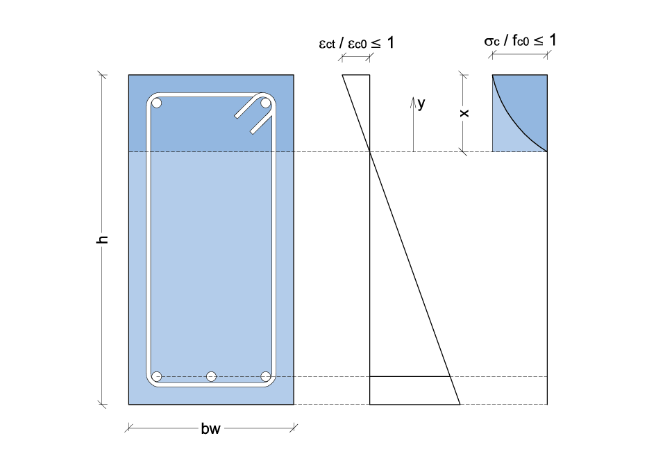

.. _Rettangolare:

********************
Sezione Rettangolare
********************

Il legame costitutivo per il calcestruzzo in compressione è generato mediante l'impiego di due curve distinte:
* una parabolica sino al raggiungimento del massimo valore di resistenza :math:`f_{c0}` e quindi di deformazione corrispondente :math:`\varepsilon_{c0}`;
* ed una lineare sino al raggiungimento del valore di tensione ultima del materiale :math:`f_{cu} \leq f_{c0}` e quindi di deformazione corrispondente :math:`\varepsilon_{cu}`.
Pertanto, nel seguito, si distingueranno i due casi a) e b).

* :math:`\varepsilon_{ct} / \varepsilon_{c0} \leq 1`

Indicando con:
:math:`f_{c0}` la tensione massima nel calcestruzzo
:math:`\varepsilon_{c0}` la corrispondente deformazione
:math:`\sigma_c` e :math:`\varepsilon_c` la tensione e la deformazione in compressione del calcestruzzo

l'equazione della parabola di Hognestad si scrive:

.. math::
    :label: R1

    \frac{ \sigma_c (\varepsilon_c) }{ f_{c0} } =
    2 ~ \Bigl( \frac{\varepsilon_c }{ \varepsilon_{c0} } \Bigr) -
    \Bigl( \frac{\varepsilon_c }{ \varepsilon_{c0} } \Bigr)^2

Introducendo i seguenti termini adimensionali di tensione e deformazione:
:math:`s_c = \sigma_c / f_{c0}` e :math:`e_c = \varepsilon_c / \varepsilon_{c0}`,
l'equazione adimensionale del ramo di parabola diventa:

.. math::
    :label: R2

    s_c (e_c) = 2 ~ e_c - e_c^2

You can add a link to equations like the one above :eq:`R1` by using ``:eq:``.

Al fine di esprimere la tensione in funzione della distanza dall'asse neutro :math:`(y)`, si opera una trasformazione di variabili. Indicando con :math:`e_{ct}` la deformazione di compressione adimensionalizzata della fibra di bordo, si pone: :math:`e_c (y) = e_{ct} ~ (y / x)`.

L'espressione della tensione del calcestruzzo adimensionalizzata diventa:

.. math::
    :label: R3

    s_c (y) = 2 ~ \Bigl( e_{ct} ~ \frac{y}{x} \Bigr) - \Bigl( e_{ct} ~ \frac{y}{x} \Bigr)^2
    
Il coefficiente di riempimento :math:`\beta_{1}` è quindi definito come il rapporto tra il diagramma effettivo delle tensioni e quello rettangolare. Quidni, si ricava come segue:

.. math::
    :label: R4

    \beta_1 =
    \frac{1}{x} \int_0^x s_c(y) \,dy
    
Sostituendo l'espressione di :math:`s_{c} (y)` e risolvendo l'integrale definito, si ottiene il coefficiente di riempimento in funzione di :math:`e_{ct}`: $$ \beta_1 = e_{ct} ~ ( 3 - e_{ct}) / 3 $$

.. math::
    :label: R5

    \beta_1 =
    e_{ct} ~ ( 3 - e_{ct} ) / 3
    
Il coefficiente :math:`\beta_{2}` consente di valutare l'esatta posizione del baricentro del diagramma delle tensioni.
Si calcola come :math:`\beta_2 = 1 - y_G / x`
essendo :math:`y_G / x` l'ascissa del baricentro del diagramma delle tensioni, adimensionalizzata rispetto alla posizione dell'asse neutro. Quest'ultima si calcola come segue:

.. math::
    :label: R6

    \frac{y_G}{x} = 
    \frac{1}{x}
    \frac{ \int_0^x s_c(y) y \,dy }{ \int_0^x s_c(y) \,dy }
    
Sostituendo anche qui l'espressione di :math:`s_{c} (y)` e risolvendo gli integrali definiti, si ottiene l'espressione di :math:`y_G / x` la quale, a sua volta, può essere inserita in quella del coefficiente :math:`\beta_{2}`, ottenendo:

.. math::
    :label: R7

    \beta_2 = 
    \frac{ e_{ct} - 4 } { 4 ~ ( e_{ct} - 3) }

