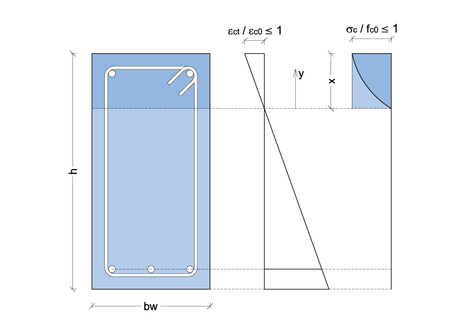

Sezione Rettangolare
====================

Il legame costitutivo per il calcestruzzo in compressione è generato mediante l'impiego di due curve distinte:
    una parabolica sino al raggiungimento del massimo valore di resistenza :math:`f_{c0}` e quindi di deformazione corrispondente :math:`\varepsilon_{c0}`;
    ed una lineare sino al raggiungimento del valore di tensione ultima del materiale :math:`f_{cu} \leq f_{c0}` e quindi di deformazione corrispondente :math:`\varepsilon_{cu}`.
Pertanto, nel seguito, si distingueranno i due casi a) e b).

a) :math:`\varepsilon_{ct} / \varepsilon_{c0} \leq 1`

Indicando con:
:math:`f_{c0}` la tensione massima nel calcestruzzo
:math:`\varepsilon_{c0}` la corrispondente deformazione
:math:`\sigma_c` e :math:`\varepsilon_c` la tensione e la deformazione in compressione del calcestruzzo

l'equazione della parabola di Hognestad si scrive:

.. math::
    :label: l1

    \sigma_c (\varepsilon_c) / f_{c0} =
    2 ~ ( \varepsilon_c / \varepsilon_{c0} ) - 
    ( \varepsilon_c / \varepsilon_{c0} )^2

Introducendo i seguenti termini adimensionali di tensione e deformazione:
:math:`s_c = \sigma_c / f_{c0}` e :math:`e_c = \varepsilon_c / \varepsilon_{c0}`,
l'equazione adimensionale del ramo di parabola diventa:

.. math::
    :label: l2

    s_c (e_c) = 2 ~ e_c - e_c^2

You can add a link to equations like the one above :eq:`l2` by using ``:eq:``.

.. math::
    :label: l22

    \nabla^2 f =
    \frac{1}{r^2} \frac{\partial}{\partial r}
    \left( r^2 \frac{\partial f}{\partial r} \right) +
    \frac{1}{r^2 \sin \theta} \frac{\partial f}{\partial \theta}
    \left( \sin \theta \, \frac{\partial f}{\partial \theta} \right) +
    \frac{1}{r^2 \sin^2\theta} \frac{\partial^2 f}{\partial \phi^2}

MathJax
=======

In Sphinx, the rendering (display) of the equations
can be done in different ways,
that will not be discussed here.

The selected option is to use the ``sphinx.ext.mathjax`` extension.
This extension uses the JavaScript package MathJax_
to transform the LaTeX markup to readable math live in the browser.

The disadvantages are the (large) size and load time of the MathJax library.

The ``mathjax_path`` in the ``conf.py`` file
indicates where the MathJax library resides.
By default, this is the MathJax site,
but the path can be changed no cross-site scripting is allowed.

Equation editors or previewers
==============================

Given that LaTeX syntax may be daunting,
a WYSIWYG math editor can be useful, or at least an interactive previewer:

*  If the objective is simply to preview the result,
   the online `Interactive LaTeX Editor`_ is very good option
   and includes numerous equations as examples.

*  LyX_ is a user-friendly LaTeX processor
   that includes an equation editor.

   In the long run, LyX may be the best choice:
   it as the same dependencies as EqualX,
   a larger development and user community,
   and does not require virtually any LaTeX knowledge.

*  EqualX_ is a LaTeX equation editor (not a document processor as LyX):
   it can be used to create the equations
   and then paste the code into the ReST document.

   Like LyX_, EqualX requires a LaTeX distribution
   (in Linux, the dependencies are automatically installed
   and TeXLive_ is included in the official repositories of all major distributions;
   for Windows systems, MiKTeX_ is a possible alternative).

Examples
========

See additional examples at http://sphinx-doc.org/ext/math.html.

Code::

      If :math:`\sigma_{1}` equals :math:`\sigma_{2}` then etc, etc.

Output:

      If :math:`\sigma_{1}` equals :math:`\sigma_{2}` then etc, etc.

Code::

      :math:`\underline{x}=[  x_{1}, ...,  x_{n}]^{T}`

Output:

      :math:`\underline{x}=[  x_{1}, ...,  x_{n}]^{T}`

Code:

.. code-block:: latex

   \langle \alpha, \beta  \rangle
   \in
   \Biggl \lbrace
   {
   M,\text{ if }
      {
       l(\underline{x}) =
         \frac { p(\underline{x}|M ) } { p(\underline{x}|U) }
         \geq
          \frac { p(U) }{ p(M) } }
   \atop
   U, \text{ otherwise }
   }

Output:

.. math::

   \langle \alpha, \beta  \rangle
   \in
   \Biggl \lbrace
   {
   M,\text{ if }
      {
       l(\underline{x}) =
         \frac { p(\underline{x}|M ) } { p(\underline{x}|U) }
         \geq
          \frac { p(U) }{ p(M) } }
   \atop
   U, \text{ otherwise }
   }
